# OS_Cloud
_Operating Systems & Cloud Computing_

In this project, we learned to create and host a Wordpress site on an AWS instance, managed and configured remotely using AWS tools. The subject of the Wordpress site I created was Ubuntu Linux, and the site contains pages with information on the history of the OS, market performance statistics, pros and cons of using Ubuntu, features that are unique to Ubuntu and a personal conclusion on the topic. A reference page for quotation is also included. The design of the site was mainly created using the Elementor Wordpress plugin, as it allows a greater degree of control over the final appearance than simply choosing a stock theme. We used the All-in-One Wordpress Migration plugin to backup our site configuration (see instructions).

  ---

**Instructions:**

* To host this page locally, first install and configure a XAMPP server setup.
* Create a blank database in PHPMyAdmin.
* Create a directory in the htdocs folder of your XAMPP installation to house the Wordpress site.
* Download and install Wordpress following the on-screen instructions.
* Install All-in-One Wordpress Migration plugin by ServMask - https://servmask.com
* Use All-in-One Wordpress Migration plugin to import .wpress file.
* Once import is complete, the site should be available locally to browse.

  ---

 **Demonstration:**
 
 Home Page
 
 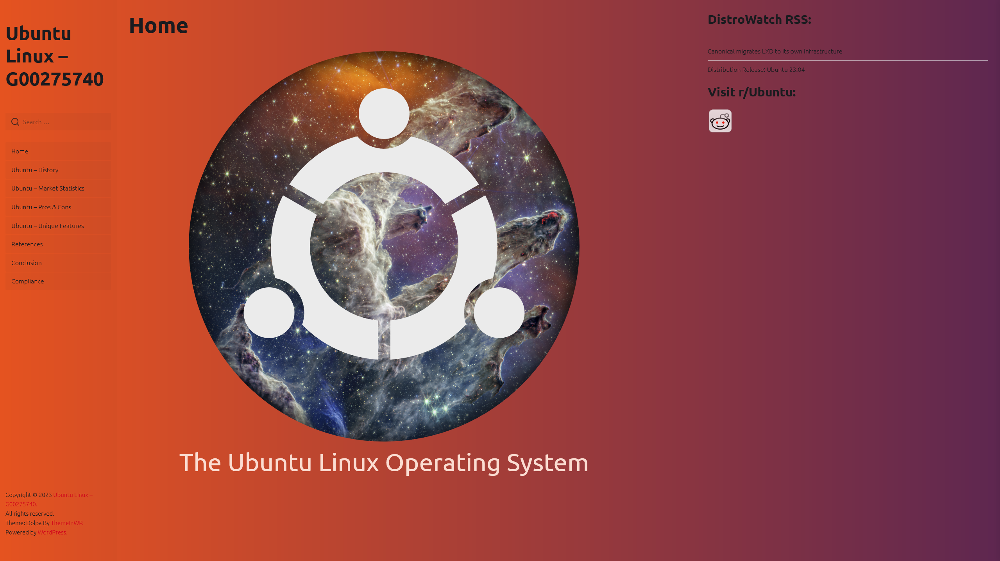
 
 Brief History of Ubuntu
 
 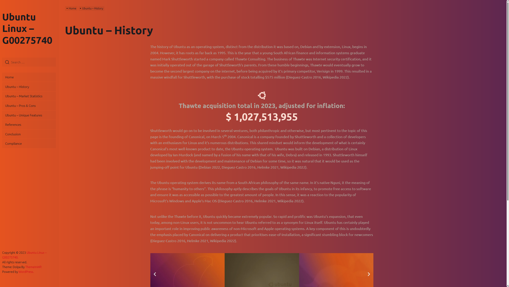
 
 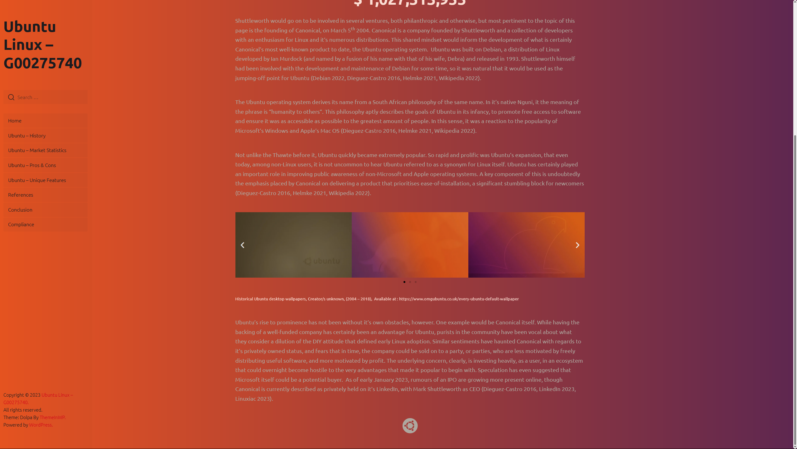
 
 Market Performance of Ubuntu
 
 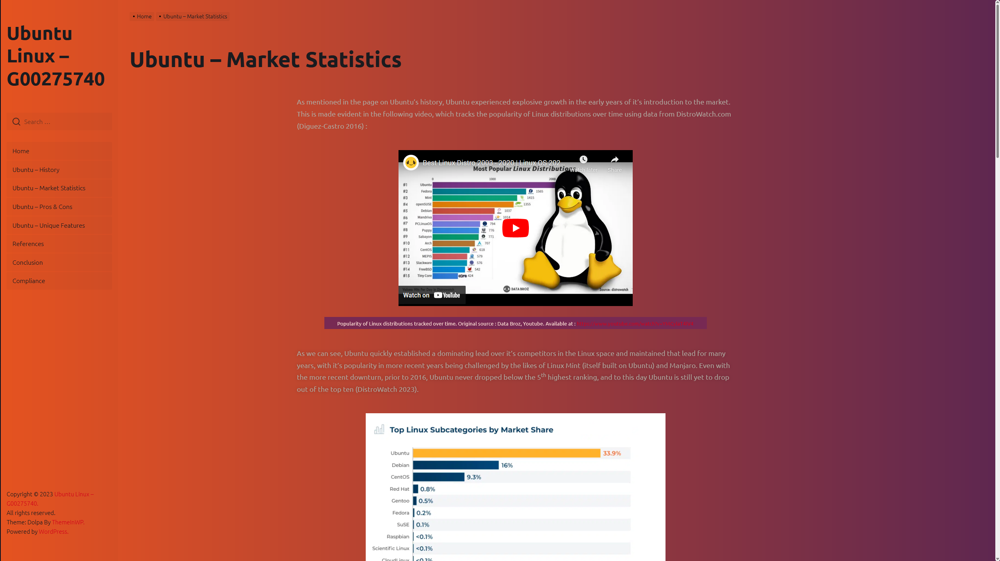
 
 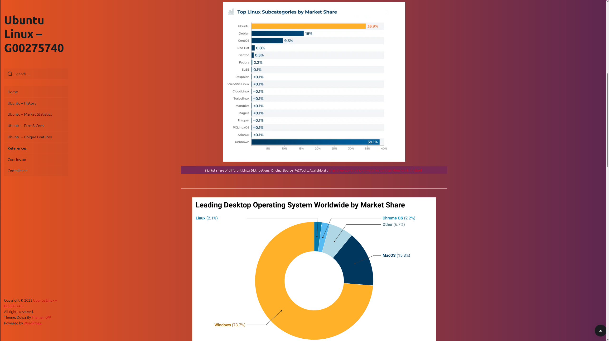
 
 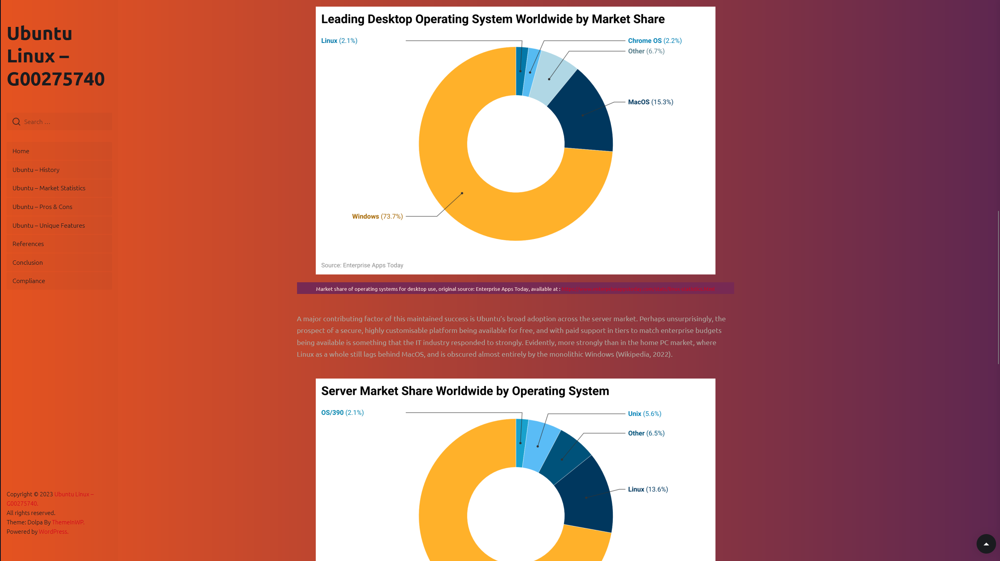
 
 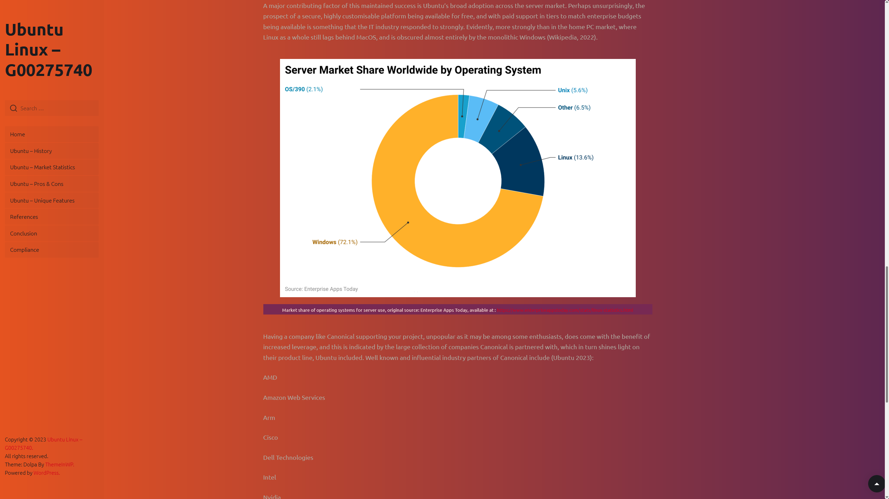
 
 Pros & Cons of Ubuntu
 
 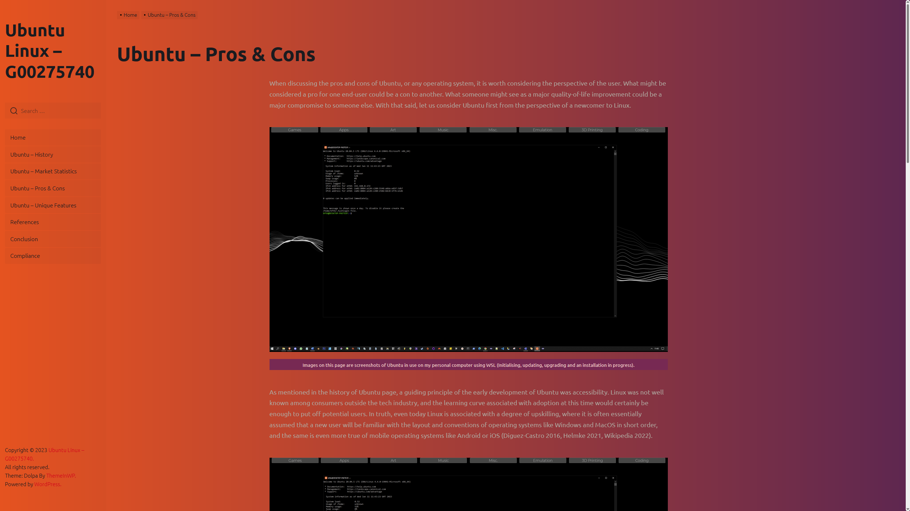
 
 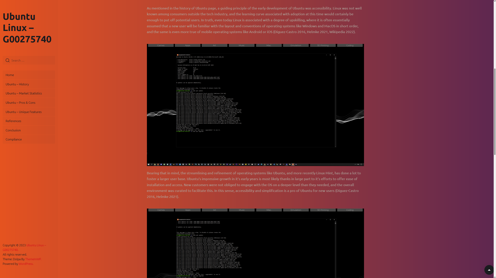
 
 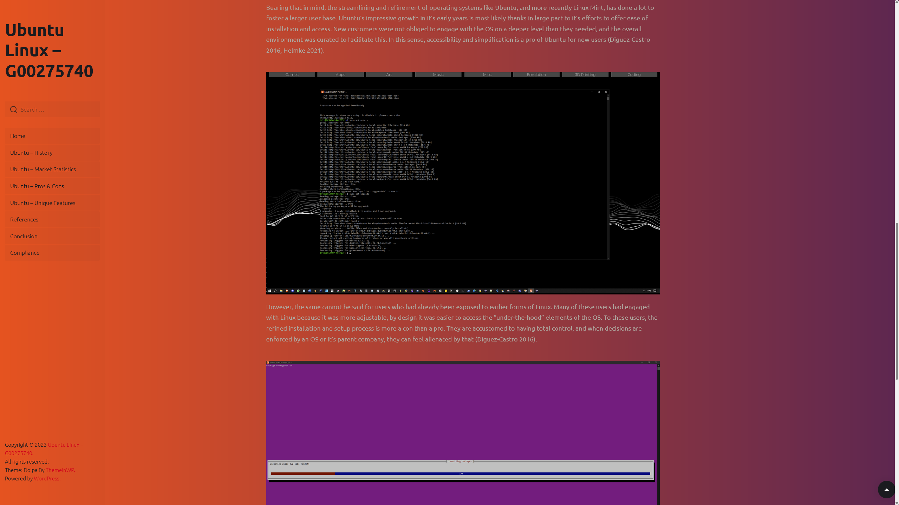
 
 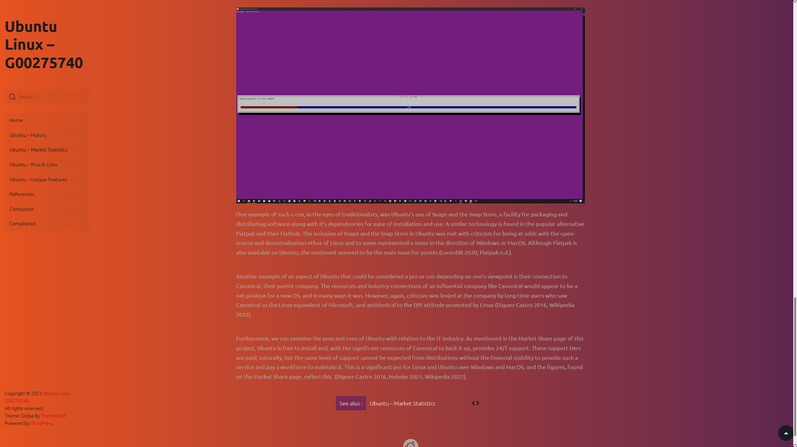
 
 Unique Features of Ubuntu
 
 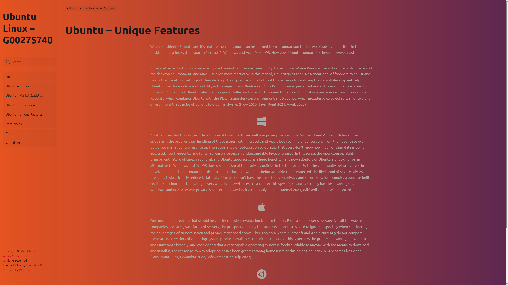
 
 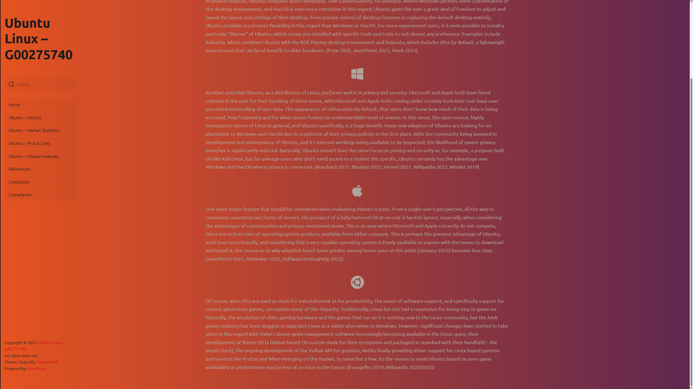
 
 Project References
 
 
 
 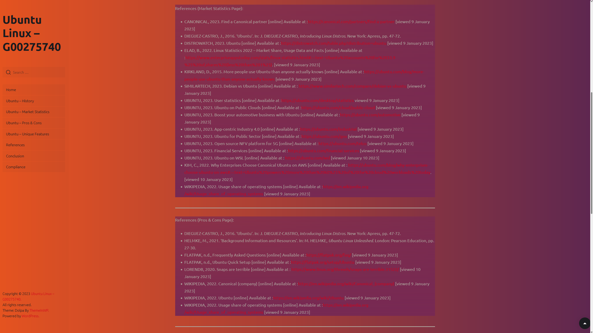
 
 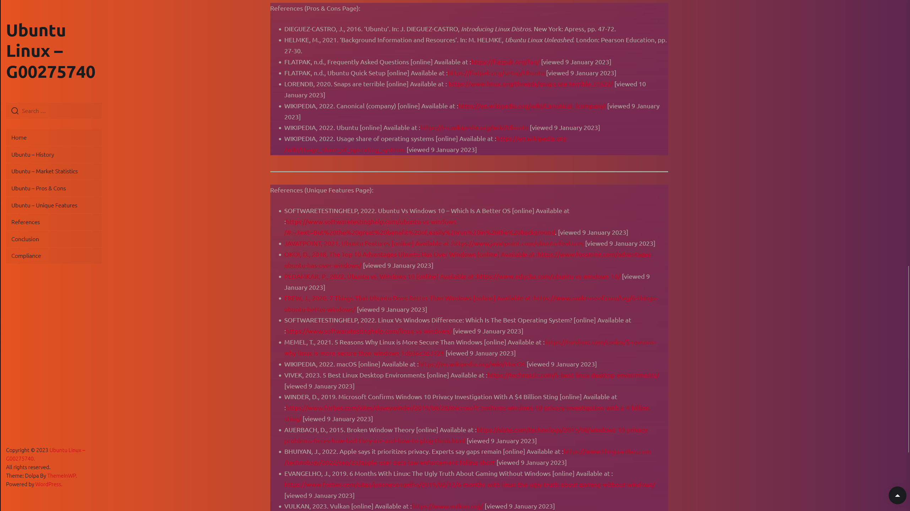
 
 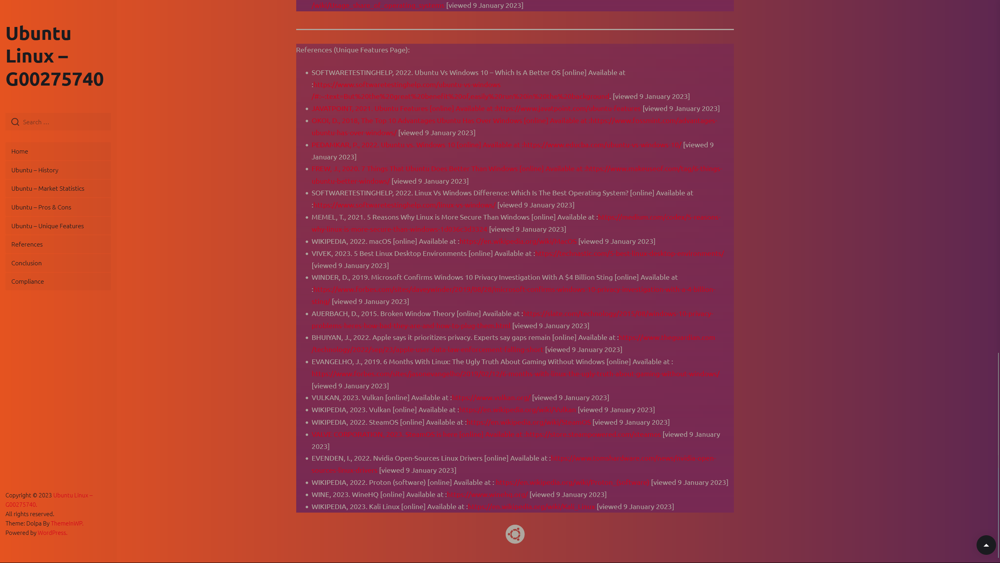
 
 Project Conclusion
 
 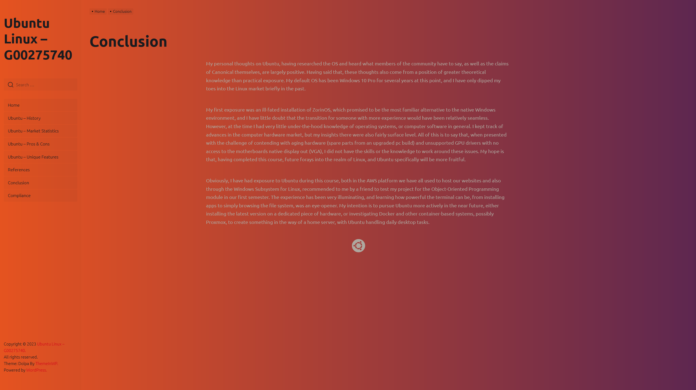
