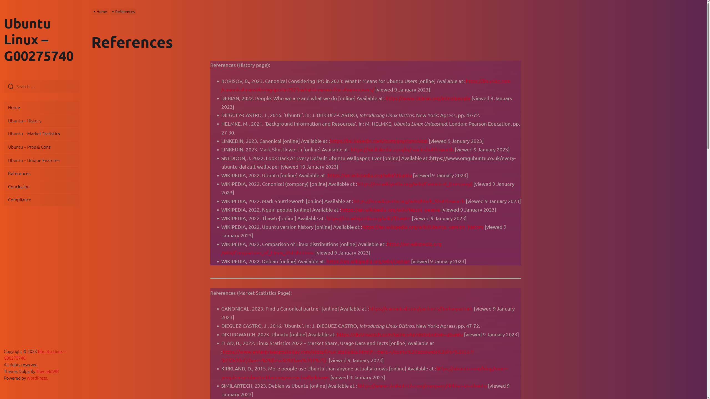

# OS_Cloud
 Operating Systems & Cloud Computing - A Wordpress website, hosted on an AWS instance, on the subject of Ubuntu Linux.
 
 Below are images of the completed Wordpress site in use.
 
 Home Page
 
 
 
 Brief History of Ubuntu
 
 
 
 
 
 Market Performance of Ubuntu
 
 
 
 
 
 
 
 
 
 Pros & Cons of Ubuntu
 
 
 
 
 
 
 
 
 
 Unique Features of Ubuntu
 
 
 
 
 
 Project References
 
 
 
 
 
 
 
 
 
 Project Conclusion
 
 
